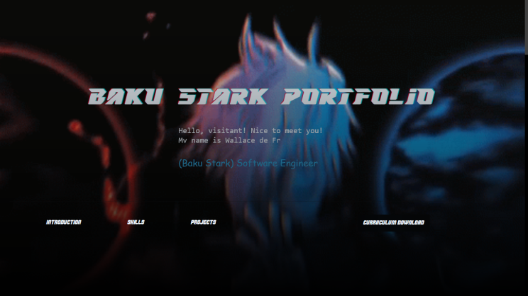

# Portfolio-Wallace

**[Portfólio - Wallace](https://baku-stark.github.io/Portfolio-Wallace/index.html)**

	
💻 Update: `Portfolio v2-0`

#

# 👾 HOME

> **PT-BR** - Inicio do projeto, Você, visitante, encontrará um pequeno texto de introdução ao meu portfólio.

> **EN-US** - Beginning of the project You, the visitor, will find a small introductory text to my portfolio.

#

# 👾 Skills

> **PT-BR** - Parte do projeto com emblemas contendo informações sobre minhas habilidades.

> **EN-US** - Part of the project with badges containing information about my skills.

# 👾 PROJECTS

> **PT-BR** - Seção onde está localizado os cards com os projetos em Python, JavaScript, Html e Css que realizei nesta minha trajetória de desenvolvedor Full Stack.

> **EN-US** - Section where the cards with projects in Python, JavaScript, Html and CSS that I carried out in my journey as a Full Stack developer are located.

#

#

# 👾 Tecnologias Utilizadas

<table>
    <tr>
        <th columnspan=2>Front-END Structure</th>
        <th columnspan=1>Language</th>
        <th columnspan=1>Extension Language</th>
        <th columnspan=1>Framework</th>
    </tr>
    <tr align="center">
        <td>
            
            
        </td>
        <td>
            
        </td>
        <td>
            
        </td>
        <td>
            
        </td>
    </tr>
</table>

#

<table>
    <tr align="center">
        <th>Autor</th>
    </tr>
    <tr align="center">
        <td>
            
             
            <a href="https://github.com/Baku-Stark">Baku-Stark</a>
        </td>
    </tr>
</table>